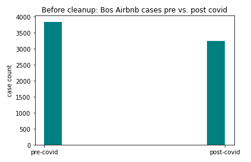
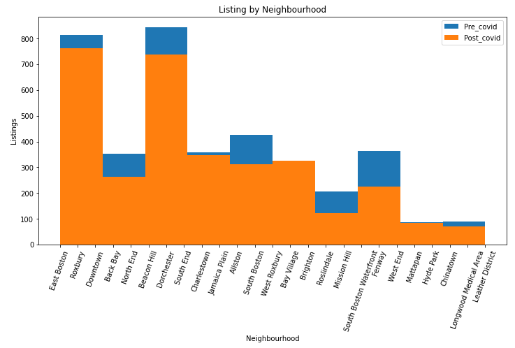
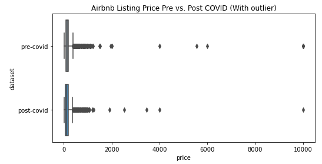
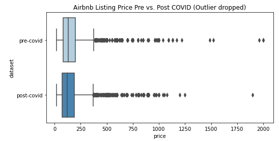
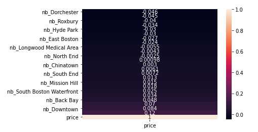
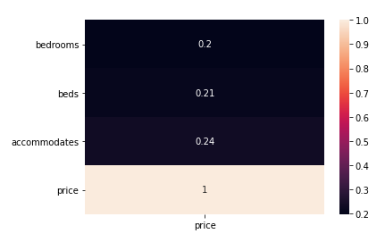
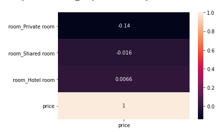
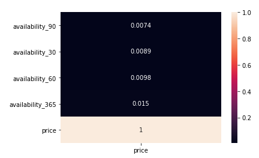
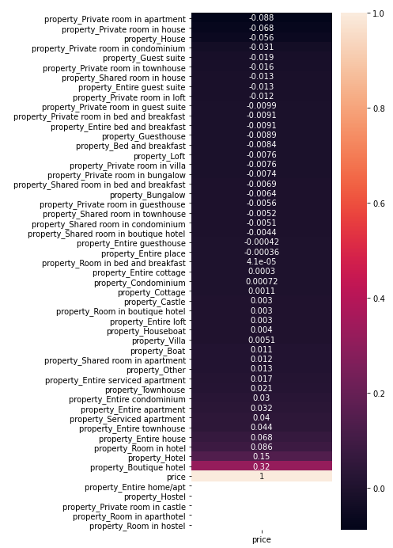

# Airbnb host helper: how much rent to charge for your property


## Executive Summary

**Airbnb, Inc.** (pronounced /ˈɛərbiːɛnbiː/ AIR-bee-ehn-bee[5] and stylized as Airbnb) is an American vacation rental online marketplace company based in San Francisco, California, United States. Airbnb maintains and hosts a marketplace, accessible to consumers on its website or via a app. Through the service, users can arrange lodging, primarily homestays, and tourism experiences or list their properties for rental.[Wikipedia](https://en.wikipedia.org/wiki/Airbnb)

Since the service launched in 2008, for travelers, Airbnb has become a great alternative option to hotels, motels, hostels, and so on. Based on a report release in May 2020, Airbnb has hosted 400 million guests since its launch in 2008. The growing market has attracted more and more people join Airbnb as a host to rent out extra rooms or apartments to create income - there are over 560,000 Airbnb hosts worldwide and around 6.1 million listings. [From 68 Airbnb Statistics: 2019/2020 Market Share Analysis & Industry Growth](https://comparecamp.com/airbnb-statistics/)

The experience of being an Airbnb host is amazing because the host is in the place to meet people from all over the world, and at the same time creating extra income from an idle property. However, there are also many challenges faced by the Airbnb hosts and how to set a price for the listing is one of them. [Challenges Faced by Hosts on Airbnb](https://blog.keycafe.com/challenges-faced-by-hosts-on-airbnb/)

Figuring out a reasonable listing price can take a lot of work because there are many conditions to take into account, for example, the location of the property, the type of property, amenities included, on/off season of the year, change in demand according to the local and regional event schedule, and so on. The host doesn't want to charge the property too low, but, at the same time, they don't want to charge the price too high either. What a reasonable price looks like? Even though hosts define the listing price of their properties, is there a going rate observed based on given conditions?

We call this service the Airbnb Host Helper. The goal of this project is, through machine learning, to make a listing price checking tool available for new and existing hosts. With the reference listing price available, it will save new and existing hosts a lot of time conducting researches on their own, help the new host determine whether the incentive worth the work, and help the existing host understand whether their current listing price is too low or too high.

The initial machine learning model is configured with Airbnb listing data from the city of Boston. The plan is to expand the service to other major cities later on once we prove the validity of the model and concept of this service.

Since the dataset adapted for this research are from before Covid-19 lockdown and five months after Covid-19 lockdown, we are going to take a deep look to understand whether there are price and list number difference per/post Covid-19.


## Folder Structure
```
|__ data
|   |__ 102420_boston_listings.csv
|   |__ bos_cleaned_allcolumns.csv
|   |__ bos_cleaned_num_columns.csv
|   |__ bos_columns_wanted_availability.csv
|   |__ boston_listings.csv
|__ images
|   |__ Airbnb_box_price_outlier_dropped.png
|   |__ Airbnb_box_price_with_outlier.png
|   |__ Airbnb_corr_availability.png
|   |__ Airbnb_corr_gn.png
|   |__ Airbnb_corr_nb.png
|   |__ Airbnb_corr_property.png
|   |__ Airbnb_corr_room.png
|   |__ Airbnb_listing_count_pre_post.png
|   |__ Airbnb_listing_nb.png
|   |__ Airbnb_listing_nb_post.png
|   |__ Airbnb_listing_nb_pre.png
|__ README.md
|__ airbnb_Helper.pdf
|__ airbnb_cleanup.ipynb
|__ airbnb_eda.ipynb
|__ airbnb_modeling-postcovid.ipynb
|__ airbnb_modeling-precovid.ipynb
|__ airbnb_modeling_pca_nooutlier.ipynb
```

## Problem Statement

- **As a new Airbnb host, how much rent should I charge customers?**
- **As an existing Airbnb host, is my listing price too high or too low?**

    
## Data Overview:

### Raw Data
There are two resources of data: [Kaggle](https://www.kaggle.com/katerynaosadchuk/boston-airbnb-listings) and [Inside Airbnb](http://insideairbnb.com/get-the-data.html). Dataset overview:

- Two sets of data are included in the research:
    - First set of data was a snapshot of listing scrapped on April 24th, 2020
        - Nick named pre-COVID since the data was generated slightly after Covid-19 lock-down.
    - Second set of data was a snapshot of listing scrapped on October 24th, 2020
        - Nick named Post-Covid since the data was generated five months after Covid-19 lock-down.
- Both data sets are limited to listings from the city of Boston.
- Size of data:
    - pre-covid: There are 3845 entries
    - post-covid: There are 3254 entries  
    


    
- Data points:
    - Pre-covid: 50 data points included.
    - Post-covid: 74 data points included.  
    - 85 unique data points identified in between two datasets.
    - Data points can be further categorized into 7 different groups:
        - ID, name, and description
        - Host related data
        - Location and neighbor
        - Property and condition
        - Availability
        - Maximum and minimum requirement
        - Review  


### Missing Data
One of the goal of this project is to understand whether the Covid-19 situation has any impact on price and count of listing. The first step is to identify the data points available in both datasets, how many missing rows in each column, and whether to keep or drop the column depending on the amount of missing roles, and the uniqueness of the column.

Among those columns kept for exploration and modeling, the following rows are also dropped:
- bedrooms:
    - Pre-covid: 4 rows dropped
    - Post-covid: 410 dropped
- beds:
    - Pre-covid: 20 rows dropped
    - Post-covid: 26 dropped

Datapoint|Pre-covid: missing rows|Post-covid: missing rows|Keep or Drop
--------:|:---------------------:|:----------------------:|:----------:
|Columns to keep|
id|0|0|Keep
name|0|0|Keep
host_is_superhost|0|0|Keep
host_identity_verified|0|0|Keep
neighbourhood_cleansed|0|0|Keep
property_type|0|0|Keep
room_type|0|0|Keep
accommodates|0|0|Keep
bedrooms|4|410|Keep
beds|20|16|Keep
amenities_dict|0|0|Keep
price|0|0|Keep
availability_30|0|0|Keep
availability_60|0|0|Keep
availability_90|0|0|Keep
availability_365|0|0|Keep
|Columns to drop|
host_id|0|0|Drop
host_since|0|0|Drop
host_location|3|4|Drop
host_response_time|562|662|Drop
host_response_rate|562|662|Drop
host_acceptance_rate|260|432|Drop
host_neighbourhood|221|199|Drop
host_total_listings_count|0|0|Drop
host_verifications|0|0|Drop
neighbourhood|0|996|Drop
latitude|0|0|Drop
longitude|0|0|Drop
bathrooms|3|3254|Drop
number_of_reviews|0|0|Drop
review_scores_rating|839|909|Drop
review_scores_accuracy|841|912|Drop
review_scores_cleanliness|840|911|Drop
review_scores_checkin|842|913|Drop
review_scores_communication|839|910|Drop
review_scores_location|841|912|Drop
review_scores_value|841|912|Drop
license|1542|1466|Drop
instant_bookable|0|0|Drop
reviews_per_month|825|890|Drop

After dropping columns and rows with missing data, the two datasets were merged into one for further clean-up and processing. To make sure we can identify data of each dataset, a new column "dataset" were added to indicate whether the entry is from Pre-Covid or Post_Covid. Here is an overview before further processing:
- 6650 entries in total, with
    - pre-covid: 3820 rows
    - post-covid: 2830 rows
- 17 columns

### Data Clean-up and Processing

The following columns are further processed for EDA and modeling: 

- price: 
    - Strip dollar sign and comma
    - Transfer the column from string to float 

- host_is_superhost
    - Create a "superhost" column with binarize value based on: 1 for true; 0 for false

- host_identity_verified
    - Create a "id_verified" column with binarize value based on: 1 for true; 0 for false

- neighbourhood_cleansed
    - Renamed to nb and then dummified

- room_type
    - Renamed to room and then dummified
    
- property_type
    - Renamed to property and then dummified

After processed, there are 95 columns in the dataset for EDA and feature selection. 


## EDA:

The goals of this EDA process are to:
- Compare listing count and price pre and post Covid-19.
- Better understand the relationship between price, neighborhood, availability, room, and property.


### Pre vs. Post Covid-19

There are 3845 Boston listings in the pre-covid dataset but only 3254 observed in the post-covid dataset. The average listing price pre-covid was $182.451, which dropped to $161.303 observed in the post-covid dataset.

In terms of the change in listing count:
- There are 2453 listings observed in both dataset.
- There are 1392 listings observed only in the Pre-Covid dataset.
- There are 801 listings observed only in the Post-Covid dataset.

The understanding here is there are 2453 listings stay listed through the Covid lock-down, 1392 listings were pulled down, and 801 listings added to the Airbnb Boston area.

item|pre-covid (by Apr 2020)|post-covid (by Oct 2020)
---:|--------:|---------:
**before clean-up**
case count| 3845|3254
average price|182.451|161.303
lisintg in both data set|2453|
Listing in pre covid only|1392|
Listing in post only||801|
**after clean-up**
dropped case count| 25|424
case count|3820|2830
average price|183.046|167.137

It's also observed that listings in most of the neighborhood dropped.



### Explore price with vs. without outliers  
The EDA process is performed against the clean-up data and we are going to take a look at data with vs. without outliers. From the box plot below, we can see most of the listings are with price under $2000-.
- When outliers are included, see box plot chart in the left, it's hard to distinguish the price different and range.
- After outliers are dropped, we can see from the chart in the right the range of listings under $ 2000.

Box Plot: Price - with outlier|Box Plot: Price - outlier dropped
:---------------------------:|:-------------------------------:
  |  


### Explore the relationship between price, neighborhood, availability, room, and property
To better understand whether the model can make price prediction based on the data point identified, we took a look at the correlation between price and various features. The observation here is that there are a correlation between price and the general condition, for example, number of bedrooms, number of beds, and the accommodation capacity. Room type is another feature included in the correlation exploration. The original assumption is that a type of room would be a strong indicator of price. Which is not the case observed here as well.
Price condition |Price and room_type
:--------------:|:------------------:
||


There were an assumption that if a listing is more popular, then the listing price would be higher - which is not a strong observation from the Price and availability chart. Based on the Price and neighborhood correlation chart, some neighborhoods do have negative impact of the listing price but it doesn't seem like a strong indicator of price either.

Price and availability|Price and neighborhood
:--------------------:|:---------------------:
|

The last feature included in the EDA process is the dummified property field. To begin with, property is similar to room type but with more subcategories.



## Modeling:

Bedrooms, beds, accommodates, availability, neighborhood, room, and property are all included in the feature list for modeling. The identified features are scaled with Scikit-learn StandardScaler Module and train-test split to set up data for modeling training and validation. PCA is adapted to identify components for better predictability.

Following Regression models are adapted:
- LinearRegression
- KNeighborsRegressor
- DecisionTreeRegressor
- BaggingRegressor
- RandomForestRegressor
- AdaBoostRegressor


## Results and Evaluation:

The first set of modeling was performed against the whole data set with outliers included. The observation from the scores below is that, other than LinerRegression, all the rest of the models are overfitting and perform especially bad against the post-covid dataset.

**Model, no PCA, with outliers**|**Pre-Covid Best Training Score**|**Pre-Covid Best Testing Score**|**Post-Covid Best Training Score**|**Post-Covid Best Testing Score**
:-----:|:-----:|:-----:|:-----:|:-----:
LinearRegression|0.2149|0.25120|0.3488|-2.6747
KNeighborsRegressor|0.3461|0.3049|0.5089|0.0859
DecisionTreeRegressor|0.8807|0.4395|0.9341|0.0009
BaggingRegressor|0.7590|0.5605|0.8050|0.0683
RandomForestRegressor|0.7808|0.4770|0.8343|0.0779
AdaBoostRegressor|0.7458|0.0314|-1.1184|-0.3039

After applying PCA and reading through variance ratio, it is determined that PCA(n_components = 49) can explaine up to 0.9414 of the data. LinearRegression and KNeighborsRegressor(n_neighbors=8) were included in the second run of modeling. The best model performed here is KNeighborsRegressor against the pre-covid data.

**Model, with PCA, with outliers**|**Pre-Covid Best Training Score**|**Pre-Covid Best Testing Score**|**Post-Covid Best Training Score**|**Post-Covid Best Testing Score**
:-----:|:-----:|:-----:|:-----:|:-----:
LinearRegression|0.215|0.2512|0.3973|0.0777
KNeighborsRegressor|0.277|0.336|0.446|0.116

The third run of modeling is configured with PCA=49 on dataset with outliers dropped. Both LinearRegression and KNeighborsRegressor are doing much better than the previous models.

**Model, with PCA, no outliers**|**Pre-Covid Best Training Score**|**Pre-Covid Best Testing Score**|**Post-Covid Best Training Score**|**Post-Covid Best Testing Score**
:-----:|:-----:|:-----:|:-----:|:-----:
LinearRegression|0.5342|0.5353|0.428|0.3528
KNeighborsRegressor|0.6335|0.6074|0.5826|0.4108


### How well the model is doing?
LinearRegression is the one performed best in this research. The Covid-19 situation introduced uncertainties and resulted in the model struggling with Post_covid data, in which there was no model can make meaningful predictions.

## Conclusions:
The improved model scores indicates that Airbnb listing prices are not totally random and there are a relationship between features to be exploited. The going rate concept does exist and we need to bring it up with less error so that we can create a useful service for target users. 


## Next Steps:

Only Boston listing data is included in the research, we can expand the model to other major cities to get more data to train the model. Since this is a service providing Airbnb hosts price reference to their listings, configuring a flask or stream instance can be adapted for end-user test to understand how the proposed service can create value for users and gather user feedback for further investigation.
